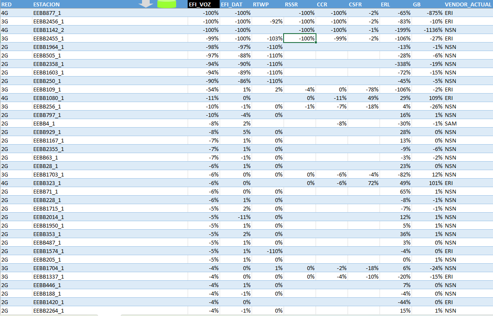
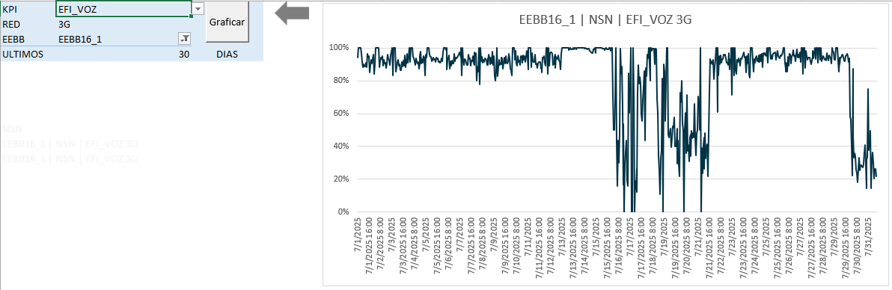

# Excel VBA Site Degradation Detector

Finds the base stations with the greatest new KPI degradation and charts any of them in one click. For every site it compares a long past period against a short recent one, so the sites that just got worse rise to the top of the list.

## What it does

- Queries the Oracle performance database directly from Excel, with the SQL embedded in the workbook and no manual export
- Compares, for every site and technology (2G, 3G, 4G), the average of each KPI over the last 24 hours against its average over the previous 29 days
- Shows the change for eight KPIs: voice efficiency, data efficiency, RTWP, RSSR, CCR, CSFR, voice traffic (Erlangs) and data traffic (GB)
- Ignores zero values when averaging, so hours without measurements do not distort the baseline
- Sorts the ranking by any KPI, worst first, and marks the active column header in black
- Shows the current vendor of each site, taken from its most recent records, so sites that went through a vendor swap are not counted twice

## One-click charting

On the `DATA` sheet, select the cell where a site and a KPI cross and click the green button. The workbook reads the technology, the site and the KPI from that cell, builds the SQL statement, runs it against the database, jumps to the `GRAFICO` sheet and draws the time series.

- **Input validation:** if the selected cell is not a valid crossing of a site and a KPI (the header row, or a column outside the KPI range), the tool shows a warning and stops. It does not run the query or update the chart.
- **Manual mode:** on the chart sheet the user can also choose the KPI, the technology, the site and the number of days back from today, then click *Graficar*.
- **Navigation:** the grey arrow on the chart sheet returns to the ranking, and the arrow on the ranking moves to the next row, so a list of degraded sites can be reviewed one after another.
- **Self-describing title:** the chart title is built from the selection, as site, current vendor, KPI and technology.

## The chart adapts to the data

- **Negative scales (RTWP):** the vertical axis is fixed from -110 to -65 dBm and the dates of the horizontal axis stay below the plot, instead of crossing it at zero
- **Percentage KPIs** (efficiencies, RSSR, CCR, CSFR): the axis runs from 0% to 105% and is formatted as percentages
- **Quantitative KPIs** (traffic in GB and Erlangs): the scale is automatic and follows the magnitude of the data, formatted as plain numbers

## How it works

1. `queries/most_degraded_sites.txt` fills the `DATA` sheet. It averages each KPI per site over the two periods and returns the difference.
2. `queries/current-vendor.txt` fills the `VENDOR_ACTUAL` sheet with the latest vendor of each site.
3. `vba/SortByKpi.bas` sorts the ranking by the chosen KPI.
4. `vba/SelectAndChart.bas` validates the selected cell and passes technology, site and KPI to the chart sheet.
5. The `CONSULTA` sheet assembles the SQL statement from those parameters with formulas.
6. `vba/BuildChart.bas` opens an ADO connection to Oracle, loads the result into `DATA_`, refreshes the PivotTable and sets the axis according to the KPI.

## Tools

Excel, VBA (ADO connection to Oracle), SQL, parameter-driven queries, PivotTables and PivotCharts

## Files

- `site-degradation-detector.xlsm`: the workbook
- `vba/`: exported VBA modules
- `queries/`: SQL behind the ranking and the current-vendor lookup
- `images/`: screenshots

## How to try it

The workbook opens with sample data already loaded, so the ranking and the chart can be explored without a database. Running a new query requires Excel for Windows, the Oracle OLE DB provider and your own connection details in `vba/BuildChart.bas` and in the workbook's data connections.

## Data

All site names are anonymized. Connection details in the code and queries are placeholders.
